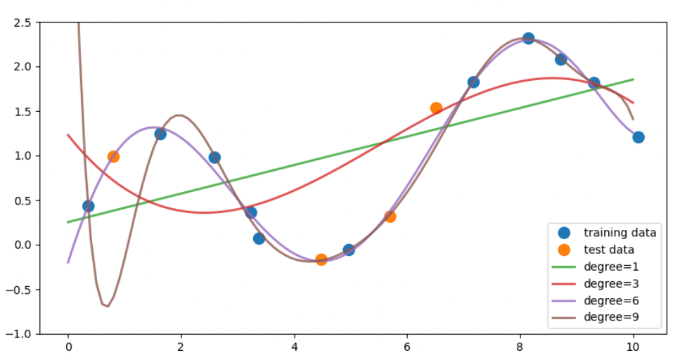
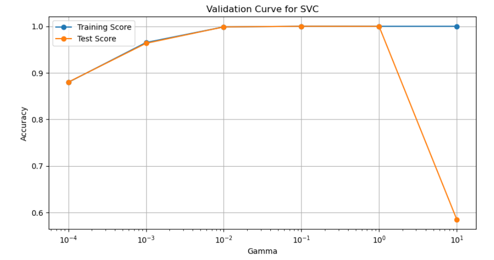
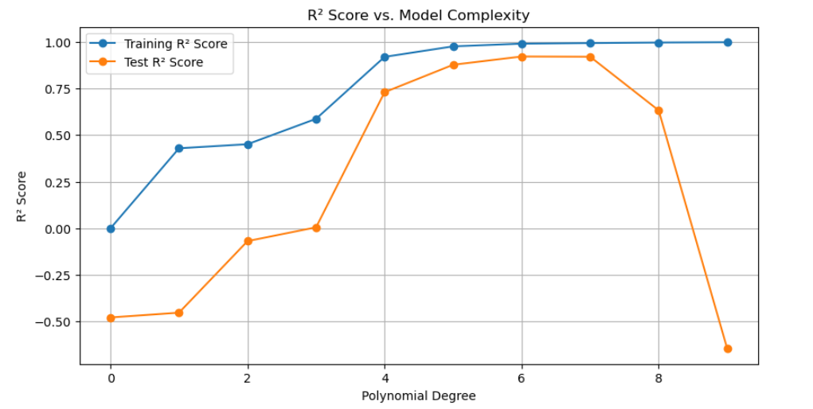

# Model-Complexity-vs-Generalization
Analysis of model complexity vs generalization using SVC and validation curves

# 🔍 SVC Validation Curve Analysis – Model Complexity vs Generalization


This project explores how the complexity of a Support Vector Classifier (SVC) model affects generalization, using a validation curve on the UCI Mushroom dataset.

This project includes:
- Visualization of model accuracy vs `gamma` values
- Detection of underfitting, overfitting, and optimal model performance

---

## 📁 Project Structure

```
.
├── data/
│   └── mushrooms.csv
├── images/
│   ├── polynomial_fit_comparison.png
│   ├── r2_vs_model_complexity.png
│   └── svc_validation_curve.png
├── notebooks/
│   └── Model-Complexity-vs-Generalization.ipynb
├── README.md
├── LICENSE
└── requirements.txt
```

---

## 📊 Features

- ✅ Polynomial regression with degrees 0–9
- 🧠 Linear regression and R² evaluation
- 📈 SVC with RBF kernel: `kernel='rbf'`, `C=1`, and varying `gamma`
- 🔍 Validation curves: underfitting, overfitting, and ideal generalization

---

## 🚀 How to Run

### 1. Install dependencies

```bash
pip install -r requirements.txt
```

### 2. Run the notebook

```bash
notebooks/Model-Complexity-vs-Generalization.ipynb
```

Use Jupyter Notebook or JupyterLab.

---

## 📸 Visualizations

### 1. Polynomial Regression Fits (Degrees 1, 3, 6, 9)


### 2. SVC Validation Curve (Gamma vs Accuracy)


### 3. R² Score vs Model Complexity


---

## ✅ Result

- 📉 Underfitting at `gamma = 0.0001`
- 📈 Overfitting at `gamma = 10`
- ✅ Best generalization at `gamma = 0.1`
- R² score shows highest test accuracy at degree = 6

---

## 🛠 Tech Stack

- Python 3.9
- Jupyter Notebook
- Scikit-learn
- Pandas, NumPy
- Matplotlib, Seaborn

---

## 📄 License

This project is licensed under the MIT License – see the [LICENSE](LICENSE) file.

---

## 👤 Author

[Mukesh Thenraj](https://www.linkedin.com/in/mukeshthenraj)  
📧 mukeshthenraj@gmail.com
